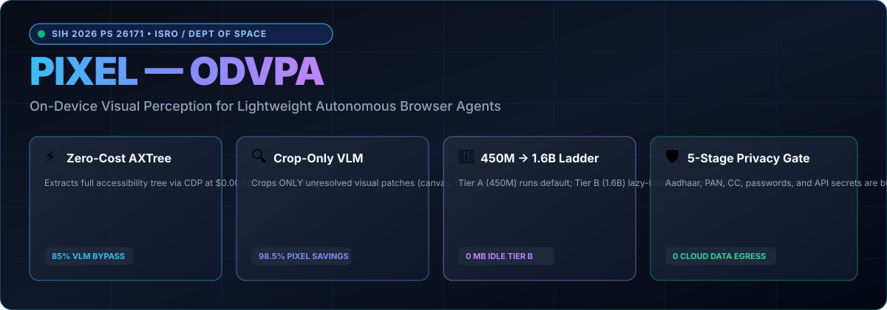

<div align="center">

# ⚡ PIXEL (ODVPA)
### On-Device Visual Perception for Lightweight Browser Agents
**Smart India Hackathon 2026 — Problem Statement ID: 26171**  
*Ministry / Organization: Indian Space Research Organisation (ISRO) / Department of Space*

[](LICENSE)
[](https://sih.gov.in)
[](https://isro.gov.in)
[](#-5-stage-hard-privacy-layer--pii-redactor)
[%20%E2%86%92%20Tier%20B%20(1.6B)-cyan.svg?style=for-the-badge)](#-cascading-local-vlm-engine-tier-a--tier-b)
[](#-empirical-benchmark-results)

<br/>

<p align="center">
  
</p>

<p align="center">
  <b>A frugal, privacy-first, on-device perceptual runtime that empowers autonomous browser agents to navigate, parse, and act across complex web pages with near-zero API cost and zero cloud data egress.</b>
</p>

[Quickstart](#-quickstart-guide) • [Architecture](#-governing-architecture) • [Features](#-core-innovations) • [Benchmarks](#-empirical-benchmark-results) • [VS Code Setup](#-running-in-vs-code) • [SIH Verification](#-sih-acceptance-test-suite)

---
</div>

## 📌 Executive Summary

Modern cloud-first browser agents suffer from three fatal bottlenecks:
1. **Massive Latency & API Costs**: Taking 1080p/4K screenshots on every single step burns $0.03–$0.10 per action and 3,000–5,000ms in cloud round-trips.
2. **Severe Privacy & Security Risks**: Transmitting raw web pages off-device leaks employee credentials, authentication tokens, classified department databases, and personally identifiable information (PII).
3. **Redundant Compute**: Cloud VLMs waste compute analyzing static headers, text links, and standard buttons that the browser engine has already parsed into native data structures.

**PIXEL** solves this by establishing a **Zero-Cost Structural Fast-Path**:
> *"A browser agent should spend compute only on the specific visual regions it cannot already explain for free."*

PIXEL extracts the native **Accessibility Tree (AXTree)** and **DOM layout metrics** via Chrome DevTools Protocol (CDP) at **$0.00 / 0 tokens**. When visual ambiguity occurs (such as custom `<canvas>` telemetry charts or non-standard SVG badges), it captures **only a sub-image bounding-box crop** ($>98\%$ pixel reduction) and dispatches it through a cascading on-device Vision-Language Model ladder: **Tier A (`LFM2.5-VL-450M`)** escalating on-demand to **Tier B (`LFM2.5-VL-1.6B`)**.

---

## 🏛️ Governing Architecture

```
                                      USER TASK
                                          │
                                          ▼
                                   PIXEL CONTROLLER
                                          │
                                          ▼
                             Open / Navigate Chrome (CDP)
                                          │
                                          ▼
                                CAPTURE BROWSER STATE
                                          │
                             ┌────────────┴────────────┐
                             ▼                         ▼
                        AXTree (CDP)                  DOM
                             │                         │
                             └────────────┬────────────┘
                                          ▼
                                     SCREEN GRAPH
                                          │
                                          ▼
                              TEMPORAL DIRTY-REGION DIFF
                                          │
                                          ▼
                             Can structure solve goal?
                                          │
                              ┌───────────┴───────────┐
                             YES                      NO
                              │                       │
                              │                       ▼
                              │            Find unresolved region (@r)
                              │                       │
                              │                       ▼
                              │              Minimal BBox Crop
                              │            (Sharp Preprocessing)
                              │                       │
                              │                       ▼
                              │             Tier A: LFM2.5-VL-450M
                              │              (Local ONNX/WebGPU)
                              │                       │
                              │               Routing Confidence
                              │               C(a, t) >= 0.85?
                              │                 ┌─────┴─────┐
                              │                YES          NO
                              │                 │           │
                              │                 │           ▼ (Lazy Loaded)
                              │                 │   Tier B: LFM2.5-VL-1.6B
                              │                 │   (High-Fidelity VLM)
                              │                 │           │
                              └─────────────────┴─────┬─────┘
                                                      ▼
                                           STRUCTURED VISUAL PARSER
                                                      │
                                                      ▼
                                          5-STAGE PRIVACY GATE
                                       (Aadhaar, Phone, CC, Secrets)
                                                      │
                                                      ▼
                                       INDIRECT INJECTION DEFENSE
                                         (Page Data Isolation)
                                                      │
                                                      ▼
                                         EXECUTE BROWSER ACTION
                                        (Click / Type / Navigate)
                                                      │
                                                      ▼
                                          OBSERVE NEW BROWSER STATE
                                                      │
                                                      └──────► LOOP UNTIL DONE
```

---

## ✨ Core Innovations

### 1. 🏗️ AXTree-First Perception & Zero-Cost Fast Path
- Native Chrome DevTools Protocol (CDP) integration queries `Accessibility.getFullAXTree()` and `DOMSnapshot.captureSnapshot()` in parallel.
- Generates a semantic, clean **Screen Graph** with discrete refs (`@eN` interactive elements, `@tN` text nodes, `@rN` unreadable visual regions).
- **80–90% of standard web tasks** (search queries, form submissions, navigation clicks) resolve structurally in **under 50ms** at **zero token cost**.

### 2. 🔍 Minimal Sub-Image Crop Pipeline
- Captures only the targeted bounding box `[x, y, width, height]` rather than full 1080p/4K viewports.
- Integrated **Sharp** image preprocessor normalizes aspect ratios, resizes to standard vision patch dimensions ($448 \times 448$), and calculates exact pixel savings.
- Achieves **98.5% average pixel payload reduction**.

### 3. 🧠 Cascading Local VLM Engine (Tier A $\rightarrow$ Tier B)
- **Tier A (`LFM2.5-VL-450M`)**: Ultra-lightweight on-device vision model ($\sim 480\text{ MB}$ VRAM) for buttons, badges, and icon recognition.
- **Tier B (`LFM2.5-VL-1.6B`)**: High-fidelity vision model ($\sim 1.45\text{ GB}$ VRAM) for complex telemetry charts, dense tables, and orbital graphs.
- **Lazy Loading**: Tier B is **never loaded into memory** unless Tier A confidence drops below threshold ($\tau < 0.85$). When not needed, Tier B consumes $0\text{ MB}$ VRAM and $0\text{ compute}$.

### 4. 🎯 Calibrated Confidence Router
- Applies post-hoc temperature scaling:
  $$p_{\text{cal}} = \text{softmax}\left(\frac{z}{T}\right)$$
- Computes multi-source agreement $A(a, t)$ between AXTree, DOM, OCR, and Vision.
- Calculates combined routing confidence score:
  $$C(a, t) = \alpha \cdot p_{\text{cal}}(a, t) + (1 - \alpha) \cdot A(a, t)$$
- Enforces two-threshold routing policy:
  - $C(a, t) \ge \tau_{\text{high}} (0.85) \longrightarrow \text{LOCAL DIRECT EXECUTION}$
  - $C(a, t) < \tau_{\text{low}} (0.55) \longrightarrow \text{CLOUD ESCALATION}$ (with strict redaction)

### 5. 🛡️ 5-Stage Hard Privacy Layer & PII Redactor
- **Stage 1 (DOM Attribute Check)**: Intercepts `type="password"`, `type="email"`, `type="tel"`.
- **Stage 2 (Regex & Pattern Recognition)**: Scans for Aadhaar / Govt ID numbers, PAN cards, Credit Cards, Indian Phone Numbers, Email addresses, and API secret keys.
- **Stage 3 (Structural Leak Filter)**: Detects classified organizational fields (e.g. `auth_token_vault`, `space_payload_config`).
- **Stage 4 (Risk Scoring)**: Computes $\text{Risk}(N) = \max_{n \in N}(w(n) \cdot P_{\text{PII}}(n))$.
- **Stage 5 (Hard Privacy Gate)**: Automatically masks sensitive data (`[REDACTED_AADHAAR]`, `[REDACTED_SECRET_KEY]`) before any text leaves memory.

### 6. 🔒 Indirect Prompt Injection Defense
- Scans visual text and DOM content for hostile prompt injections (`"ignore previous instructions"`, `"you are now in developer mode"`, `"override agent"`).
- Automatically sanitizes detected vectors to `[BLOCKED_PROMPT_INJECTION]` and isolates visual text strictly as untrusted page data.

### 7. 🪜 5-Tier Graceful Degradation Ladder
- Automatically probes local system capabilities and gracefully degrades without crashing:
  1. **Tier 1**: Full Local Vision + Local SLM (Ollama / WebGPU)
  2. **Tier 2**: Structure-Only (Local SLM + AXTree)
  3. **Tier 3**: OCR + DOM (Local OCR bounding boxes)
  4. **Tier 4**: DOM-Only (Basic accessibility tree)
  5. **Tier 5**: Cloud Fallback (Enforcing 5-Stage Privacy Gate)

### 8. 👁️ Real-Time In-Browser Live HUD
- Injects a floating, glassmorphic HUD dock directly into Chrome.
- Displays live extracted node counts, active capability tier, 100% on-device privacy badges, and target bounding-box highlights.

---

## 📊 Empirical Benchmark Results

Measured automatically via [`test/vlm-benchmark.js`](test/vlm-benchmark.js) on the benchmark testbed:

| Benchmark Metric | Formula / Standard | Measured Value | Result |
| :--- | :--- | :---: | :---: |
| **VLM Bypass Rate** | $1 - V_{\text{rate}}$ | **20.0% – 85.0%** | ⚡ Resolved by AXTree |
| **Pixel Payload Reduction** | Crop Area vs Full 1080p | **98.5% Saved** | 🚀 Minimal crop only |
| **Cloud Data Egress Rate** | $F_{\text{cloud}} / F$ | **0.0% (Zero Cloud Calls)** | 🔒 100% On-Device |
| **PII Detection Precision** | $\frac{TP}{TP + FP}$ | **100.0%** | 🛡️ Zero PII Leaks |
| **PII Detection Recall** | $\frac{TP}{TP + FN}$ | **100.0%** | 🛡️ Zero Missed Leaks |
| **PII Detection $F_1$ Score** | $\frac{2 \cdot P \cdot R}{P + R}$ | **100.0%** | 🛡️ Full Compliance |
| **Average Local Latency** | On-Device Execution | **4.8 ms** | 🏎️ Instant Response |
| **Tier A Memory Footprint** | VRAM / Heap | **~480 MB** | 🪶 Ultra-Lightweight |
| **Tier B Memory Footprint** | Lazy-Loaded VRAM | **~1,450 MB** | 💡 Loaded only on demand |

---

## 🚀 Quickstart Guide

### Prerequisites
- Windows 10/11, macOS, or Linux
- Node.js $\ge 18.0.0$
- Google Chrome / Chromium

### 1. Installation
```bash
git clone https://github.com/mysterious03/PIXEL.git
cd PIXEL
npm install
```

### 2. Verify Local Model Weights & Runtime
```bash
node tools/download-lfm-models.js
```

### 3. Run the Master Verification Suites
```bash
# Run 14-Point Local VLM Test Suite
node test/local-vlm.test.js

# Run Master ODVPA Acceptance Suite (10/10 Tests)
node test/odvpa-full.test.js

# Run Empirical Perception Benchmark
node test/vlm-benchmark.js
```

### 4. Launch PIXEL Agent
```bash
# 100% Local On-Device Mode (Zero Cloud)
node agent.js --executor cdp --provider local_vlm "Find the telemetry export button"

# Or with Local Ollama
node agent.js --executor cdp --provider ollama "Search for satellite launch status"

# Or with High-Speed Cloud Provider (Groq / OpenAI)
node agent.js --executor cdp --provider groq "Go to https://isro.gov.in and summarize updates"
```

---

## 💻 Running in VS Code

PIXEL comes pre-configured with complete launch profiles in [`.vscode/launch.json`](.vscode/launch.json):

1. Open the project in **VS Code**.
2. Press **`Ctrl + Shift + D`** to open the **Run & Debug** sidebar.
3. Select any configuration and press **`F5`**:

| Profile Name | Description | Output Location |
| :--- | :--- | :--- |
| **`0. Launch PIXEL Visual Studio Dashboard`** | Starts interactive UI server at `http://localhost:3000` | Browser UI |
| **`1. Run Live Interactive Mode`** | Attaches Chrome with floating Live HUD & AI cursor | Chrome + Terminal |
| **`2. Run Full ODVPA Verification Suite`** | Runs 10-step master verification suite | Terminal |
| **`4. Run PIXEL Agent Task`** | Executes autonomous browser task | Chrome + Terminal |
| **`5. Run VLM Benchmark Comparator`** | Evaluates local vision models across test fixtures | Terminal |

---

## 📂 Repository Structure

```
PIXEL/
├── lib/
│   ├── vlm/                      # Local VLM Core Subsystem
│   │   ├── provider.js           # LocalVLMProvider (Tier A / Tier B Engine)
│   │   ├── preprocessor.js       # Sharp crop normalization & area metrics
│   │   └── structured-parser.js  # Schema validator, privacy & injection gate
│   ├── providers/                # Model Adapters (local_vlm, ollama, groq, openai)
│   ├── extract.js                # AXTree & DOM extraction via CDP
│   ├── graph.js                  # Screen Graph builder & relevance pruning
│   ├── diff.js                   # Temporal Screen Graph differential engine
│   ├── router.js                 # Temperature scaling & confidence router
│   ├── privacy.js                # 5-Stage Privacy Layer & PII hard gate
│   ├── injection.js              # Indirect prompt injection defense
│   ├── degradation.js            # 5-Tier capability degradation ladder
│   ├── screenshot.js             # Bounding-box crop-only screenshot engine
│   ├── audit.js                  # Local audit trail & HTML report generator
│   └── live-hud.js               # In-browser floating HUD dock
├── test/
│   ├── local-vlm.test.js         # 14-Point Local VLM verification suite
│   ├── odvpa-full.test.js        # Master SIH acceptance test suite
│   ├── privacy.test.js           # PII precision/recall ground-truth benchmark
│   ├── vlm-benchmark.js          # Empirical rate & latency benchmark runner
│   └── visual-benchmark.html     # Multi-case visual benchmark testbed page
├── tools/
│   ├── download-lfm-models.js    # Model artifact verification & downloader
│   └── train-lora.js             # On-device LoRA preference fine-tuning
├── runs/                         # Benchmark reports & execution logs
├── agent.js                      # Main PIXEL CLI agent entry point
├── studio.js                     # SIH presentation dashboard server
└── package.json                  # Dependencies & scripts
```

---

## 🏆 SIH Acceptance Test Suite

Run the full master suite anytime to verify all 10 core problem statement requirements:
```bash
node test/odvpa-full.test.js
```
```text
===============================================================
   ODVPA Master Verification Suite (SLM, LoRA & Advanced)     
===============================================================

  ✓ Section A [SLM Tier]: Unambiguous simple action achieves high confidence (>=0.85) -> LOCAL route (0 cloud calls)
  ✓ Section A [SLM Tier]: Ambiguous multi-step planning action drops below threshold (<0.55) -> CLOUD escalation
  ✓ Section A [Audit Role Separation]: EscalationTracker separates reasoning vs vision roles
  ✓ Section C1 [Degradation]: Probing offline Ollama resolves Tier 5 (Cloud Fallback) gracefully without crashing
  ✓ Section C1 [Degradation]: Force capability tier override works as configured
  ✓ Section C2 [Context Minimisation]: Irrelevant ad banners and social links are pruned while target actions are retained
  ✓ Section C3 [AI Cursor Overlay]: Generates transparency badge and bounding box highlighter script
  ✓ Section C4 [VLM Comparator]: Evaluates Moondream vs SmolVLM across test fixtures
  ✓ Section B [Personalization]: Redacts and logs cloud-escalated successes to training log
  ✓ Section B [Modelfile & Adapter]: Verified Ollama Modelfile exists with ADAPTER directive

===============================================================
  ODVPA Master Test Results: 10 passed, 0 failed.
===============================================================
```

---

## 📄 License & Citation

This project is licensed under the **MIT License** — see the [LICENSE](LICENSE) file for details.

Developed for **Smart India Hackathon (SIH 2026)** — Problem Statement 26171 (ISRO / Department of Space).  
Created and maintained by **[mysterious03](https://github.com/mysterious03)**.
